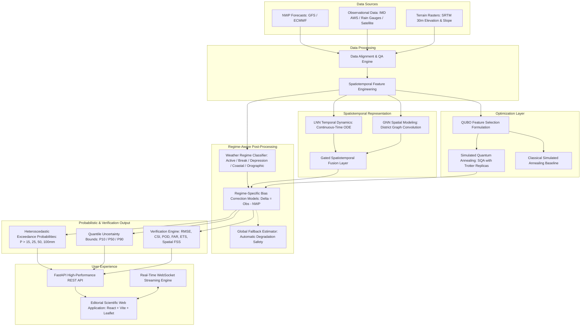

# VARSHA-Q System Architecture

**Project:** VARSHA-Q  
**Subtitle:** Quantum-Inspired Spatiotemporal AI for Regime-Aware Rainfall Forecast Correction  
**Team:** QUANTUM LEAPERS  

---

## 1. High-Level Architecture Diagram



---

## 2. Directory Structure

```
varsha-q/
│
├── backend/
│   ├── app/
│   │   ├── api/             # REST endpoints & WebSocket streams
│   │   ├── core/            # Database engine & environment configurations
│   │   ├── models/          # SQLAlchemy async database models
│   │   ├── schemas/         # Pydantic request/response validation schemas
│   │   ├── services/        # Orchestration services (Forecast, District, Verification)
│   │   ├── data/            # Data providers (IMD, Open-Meteo, Demo, File) & Alignment
│   │   ├── ml/              # LNN ODE, Spatial GNN, Fusion, Regime Classifier, Bias Correction
│   │   ├── optimization/    # QUBO matrix builder, SQA Trotter annealer, CSA baseline, QEA
│   │   └── verification/    # Continuous RMSE/MAE, Categorical CSI/POD/FAR/ETS, Spatial FSS
│   └── tests/
│
├── frontend/
│   ├── package.json
│   ├── vite.config.ts
│   ├── tailwind.config.js
│   ├── src/
│   │   ├── components/      # Editorial Navbar, Hero, Forecast, Regimes, Map, Verification, Modal
│   │   ├── services/        # Frontend API client
│   │   └── types/           # TypeScript data interfaces
│
├── data/
│   ├── demo/                # Synthetic multi-regime replay scenarios
│   ├── geo/                 # India district GeoJSON & topographic metadata
│   └── raw/                 # Uploaded research datasets
│
├── models/                  # Checkpoints: regime_classifier.pkl, bias_correction.pkl, weights.pt
├── configs/                 # Hyperparameters (train.yaml)
├── scripts/                 # Standalone reproducible CLI tools (train_all.py, run_demo.py, etc.)
├── reports/                 # Empirical validation reports & training summaries
├── tests/                   # Full pytest suite (22 unit & integration tests)
├── docker-compose.yml
├── Dockerfile
├── requirements.txt
├── .env.example
└── README.md
```

---

## 3. Graceful Failure & Offline Reliability

1. **Live Feed Disconnection:** If Open-Meteo or IMD servers are unreachable or encounter network timeouts, the system transitions gracefully to the synchronized `DemoProvider` replay dataset without throwing unhandled exceptions.
2. **Missing Checkpoints:** If a specialized regime model has insufficient training samples, the pipeline automatically routes inference through the global fallback model, signaling `"Regime-specific model unavailable -> global fallback"`.
3. **Hardware Agnosticism:** Automatic PyTorch device detection routes tensor operations to CUDA GPUs if present, or degrades cleanly to multi-threaded CPU execution.
