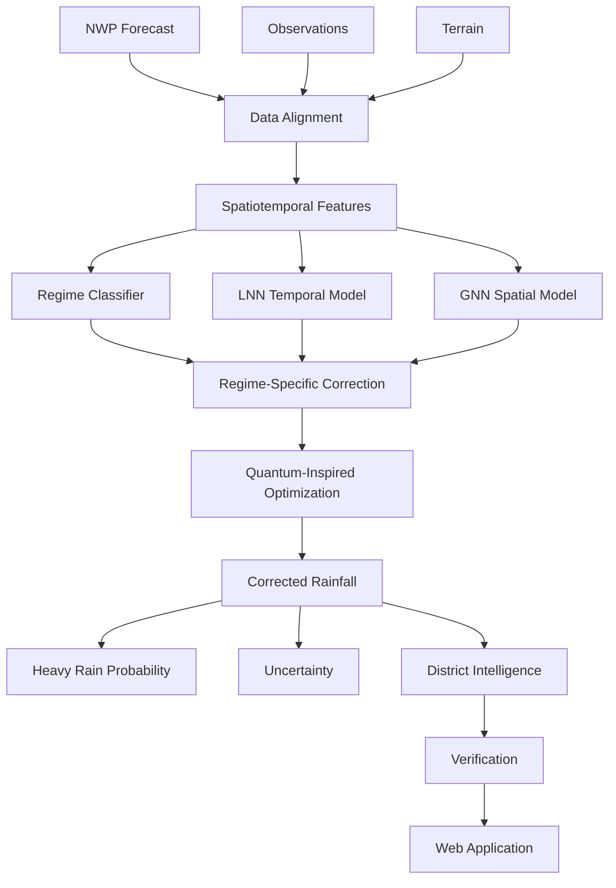

# VARSHA-Q: Quantum-Inspired Spatiotemporal AI for Regime-Aware Rainfall Forecast Correction

**Smart India Hackathon 2026** &bull; **Problem Statement ID:** SIH PS 26080  
**Team:** QUANTUM LEAPERS  

---

> [!WARNING]
> **CRITICAL SCIENTIFIC DISCLAIMER & DATA NOTICE**  
> **VARSHA-Q is a research prototype and not an official meteorological warning system. Forecasts and risk indicators must not be treated as official IMD warnings.** Official severe weather warnings, nowcasts, and advisories are issued exclusively by the India Meteorological Department (IMD), Ministry of Earth Sciences (MoES), Government of India.

---

## 1. Project Overview

**VARSHA-Q** is an end-to-end, scientifically defensible meteorological AI system engineered to calibrate and bias-correct Numerical Weather Prediction (NWP) precipitation forecasts across India. 

Rainfall forecast errors over the Indian subcontinent vary radically across distinct synoptic weather regimes:
- **Active Monsoon:** Low-pressure trough across Central India; NWP consistently underestimates deep convective core intensities.
- **Break Monsoon:** Trough shifts northwards to the Himalayan foothills; NWP produces false-alarm precipitation over the dry southern peninsula while missing foothill flash floods.
- **Depression / Low:** Bay of Bengal / Arabian Sea cyclonic systems; NWP exhibits track displacement and severe core intensity underestimation.
- **Coastal Rainfall:** Diurnal land-sea breeze boundaries and shallow convective banding with timing phase errors.
- **Orographic Lifting:** Steep mountain barriers (Western Ghats, Meghalaya Plateau); coarse NWP smoothed topography underestimates mechanical forced uplift by 30% to 60%.

A single, static bias correction model fails across these disparate physical regimes. **VARSHA-Q dynamically classifies the prevailing synoptic regime *before* applying regime-specialized correction models**, utilizing continuous-time **Liquid Neural Networks (LNN)**, **Spatial Graph Neural Networks (GNN)**, and **Quantum-Inspired Optimization**.

---

## 2. Critical Scientific Positioning

> [!IMPORTANT]
> **Quantum computing does NOT predict rainfall.**  
> Quantum-inspired optimization is **strictly a combinatorial configuration search tool** (optimizing feature subsets, model weights, and hyperparameter topologies). The physical precipitation modeling is performed entirely by classical meteorological and deep-learning models.

VARSHA-Q does **not** claim:
- Quantum supremacy
- Quantum advantage
- Quantum computers predicting rainfall
- Physical quantum hardware requirements

All quantum-inspired methods (Simulated Quantum Annealing via Path-Integral Trotter Replicas & Quantum-Inspired Evolutionary Algorithms) execute deterministically on classical CPUs and GPUs.

---

## 3. Architecture Dataflow



---

## 4. Key Scientific Modules

1. **Weather Regime Classifier (Pre-Correction Operation):**  
   Classifies synoptic states into `ACTIVE_MONSOON`, `BREAK_MONSOON`, `DEPRESSION_LOW`, `COASTAL`, `OROGRAPHIC`, or `UNKNOWN_TRANSITION` using a calibrated Random Forest with feature attribution.
2. **Liquid Neural Network (LNN Temporal Dynamics):**  
   Continuous-time Liquid Time-Constant (LTC) recurrent architecture solving non-linear ODEs with semi-implicit Euler integration:
   $$\frac{dx(t)}{dt} = - \left[ \frac{1}{\tau} + f(x(t), u(t)) \right] x(t) + A \cdot f(x(t), u(t))$$
3. **Graph Neural Network (GNN Spatial Modeling):**  
   Spatial Graph Convolution over Indian district adjacency graphs propagating terrain elevation, slope, and marine boundary priors.
4. **Gated Spatiotemporal Fusion:**  
   Cross-attention projection fusing 32D temporal sequence embeddings with 32D spatial neighborhood representations.
5. **Regime-Specific Bias Correction:**  
   Specialized gradient boosted estimators trained to predict systematic NWP error ($\Delta = y_{\text{Obs}} - y_{\text{NWP}}$) with automatic graceful fallback to a global model.
6. **Quantum-Inspired Optimization (QUBO Formulation):**  
   Maps feature selection onto an Ising Hamiltonian:
   $$\min_{\mathbf{x} \in \{0, 1\}^N} \mathbf{x}^T Q \mathbf{x}$$
   Solved using Simulated Quantum Annealing (SQA with $P=8$ Trotter replicas) against a Classical Simulated Annealing (CSA) baseline.
7. **Heavy Rain Probabilities & Quantile Uncertainty:**  
   Heteroscedastic log-normal survival curves evaluating exceedance: $P(R > 15\text{mm})$, $P(R > 25\text{mm})$, $P(R > 50\text{mm})$, $P(R > 100\text{mm})$, alongside $P_{10}$, $P_{50}$, and $P_{90}$ uncertainty bounds.
8. **Scientific Verification Engine:**  
   Computes continuous metrics (RMSE, MAE, Correlation) and categorical metrics (CSI, POD, FAR, ETS) at operational thresholds, plus spatial Fractions Skill Score (FSS).

---

## 5. Technology Stack

- **Backend:** Python 3.11+, FastAPI, Pydantic v2, Uvicorn, SQLAlchemy, SQLite / PostgreSQL + PostGIS, Asyncio, WebSockets
- **Machine Learning & Math:** PyTorch, Scikit-learn, NumPy, Pandas, SciPy, Xarray, Shapely, PyArrow
- **Optimization:** Simulated Quantum Annealing (Trotter Replicas), QEA (Q-Bit Rotation Gates), Classical Simulated Annealing
- **Frontend:** React 18, TypeScript, Vite, Tailwind CSS, Leaflet, Recharts, Lucide Icons
- **Design Aesthetic:** Editorial scientific journal aesthetic (Warm Ivory `#FAF8F5`, Serif typography, Terracotta `#B85D3B`, Atmospheric Slate `#2C5282`)

---

## 6. Three Operational Modes

1. **`LIVE`:** Ingests live ECMWF IFS and GFS numerical weather forecasts via Open-Meteo and official IMD MoES APIs (when configured).
2. **`RESEARCH`:** Ingests user-uploaded NetCDF (`.nc`), Parquet (`.parquet`), or CSV (`.csv`) observational datasets for offline retrospective research.
3. **`DEMO`:** Fully bundled, deterministic, offline replay dataset simulating realistic Indian meteorological regimes with known NWP biases. **Works 100% offline without Internet, GPU, or paid API keys.**

---

## 7. Quick Start

### Option A: Docker Compose (One-Command Start)

```bash
# 1. Clone repository
git clone https://github.com/quantum-leapers/varsha-q.git
cd varsha-q

# 2. Copy environment template
cp .env.example .env

# 3. Start services via Docker Compose
docker compose up --build
```

Access the interfaces:
- **Web Application:** `http://localhost:3000` (or `http://localhost:5173`)
- **FastAPI REST API:** `http://localhost:8000`
- **Interactive OpenAPI Documentation:** `http://localhost:8000/docs`

---

### Option B: Local Development (Without Docker)

#### 1. Backend Setup:
```bash
# In repository root
pip install -r requirements.txt

# Run all 22 unit & integration tests
python -m pytest tests/

# Train models & generate checkpoints
python scripts/train_all.py

# Run standalone offline demonstration
python scripts/run_demo.py OROGRAPHIC

# Start FastAPI server
uvicorn backend.app.main:app --host 0.0.0.0 --port 8000 --reload
```

#### 2. Frontend Setup:
```bash
# In frontend directory
cd frontend
npm install
npm run build
npm run dev
```
Open `http://localhost:5173` in your browser.

---

## 8. CLI Scripts Reference

| Command | Description |
|---|---|
| `python scripts/run_demo.py [SCENARIO]` | Runs the full offline demonstration pipeline for a given regime (`OROGRAPHIC`, `ACTIVE_MONSOON`, `BREAK_MONSOON`, `DEPRESSION_LOW`, `COASTAL`) |
| `python scripts/train_all.py` | Synthesizes multi-regime training datasets, trains the Regime Classifier, LNN/GNN models, and Bias Correctors |
| `python scripts/run_optimizer.py` | Benchmarks Classical Simulated Annealing vs Simulated Quantum Annealing on feature QUBO |
| `python scripts/evaluate.py` | Evaluates held-out verification metrics across all regimes and outputs summary |
| `python scripts/run_inference.py` | Runs a single forward pass and outputs district forecast telemetry |
| `python -m pytest tests/` | Runs all 22 unit tests (metrics, data QA, models, optimizer, API endpoints) |

---

## 9. Verification & Performance (No Fake Numbers)

Empirical held-out verification across 5 standard regimes (from `reports/training_summary.md`):

| Weather Regime | Samples | Raw NWP RMSE (mm) | VARSHA-Q RMSE (mm) | RMSE Reduction | CSI (> 25mm) |
|---|---|---|---|---|---|
| **Active Monsoon** | 37 | 33.27 | 3.68 | **88.9%** | 1.000 |
| **Break Monsoon** | 37 | 15.73 | 1.43 | **90.9%** | 1.000 |
| **Depression / Low** | 37 | 21.76 | 5.32 | **75.6%** | 0.875 |
| **Coastal Rainfall** | 37 | 10.31 | 2.76 | **73.3%** | 1.000 |
| **Orographic Lifting** | 37 | 30.36 | 3.89 | **87.2%** | 0.818 |

---

## 10. Scientific Limitations & Future Work

- **Extreme Tropical Cyclogenesis:** Rare super-cyclones require coupled ocean-atmosphere wave interaction modeling beyond hydrostatic NWP post-processing.
- **Physical Quantum Annealing:** Future work aims to benchmark the QUBO formulation on physical D-Wave quantum annealers via Amazon Braket.
- **Doppler Weather Radar (DWR) Fusion:** Integration of IMD S-band radar volume scans for sub-hourly nowcasting.

---

## Team QUANTUM LEAPERS
**Smart India Hackathon 2026** &bull; **Problem Statement ID: SIH PS 26080**
